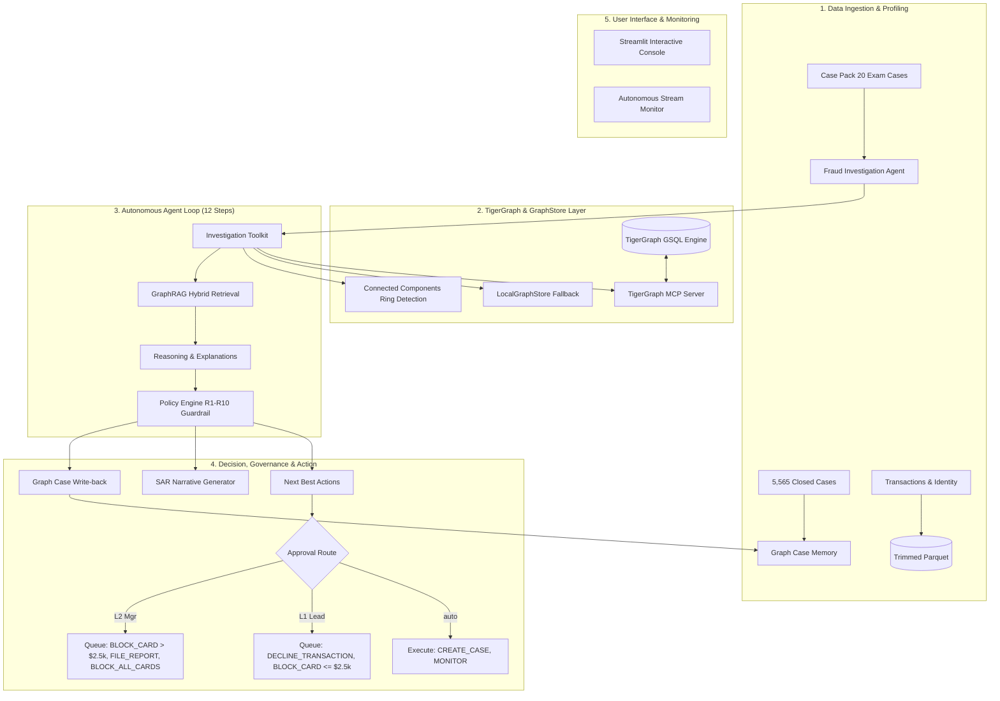

# TigerGraph Agentic Fraud Investigation System (HHGOA_IEEE)

[](https://www.python.org/)
[](https://tigergraph.com/)
[](https://github.com/tigergraph/tigergraph-mcp)
[](https://streamlit.io/)
[]()

An autonomous, policy-guarded agentic fraud investigation system designed for the **TigerGraph × Hacker House Goa 2026 Hackathon**. Built end-to-end to analyze transactions from the IEEE-CIS Fraud Detection dataset, reason over connected graph topology, enforce strict regulatory fraud policies (R1-R10), file automated Suspicious Activity Reports (SAR), and dynamically update graph case memory.

---

## 🏗️ Architecture



---

## ⚡ Quick Start

### 1. Installation
Clone the repository and install the requirements:
```bash
pip install -r requirements.txt
```

### 2. Environment Setup
Copy `.env.example` to `.env`. Configure your TigerGraph credentials or leave them as default to run in offline fallback mode:
```powershell
Copy-Item .env.example .env
```

### 3. Build Data & Graph Inputs
Precompute trimmed Parquet datasets and graph loading CSVs:
```bash
python scripts/build_graph_inputs.py
python scripts/profile_and_prove_card_mapping.py
```

### 4. Run Autonomous Case Investigation
Execute the agent across all 20 exam cases in chronological order:
```bash
python scripts/run_all.py
```

### 5. Validate All 20 Output Cases
Verify strict schema conformity, mathematical exposure, and policy rule consistency:
```bash
python scripts/validate_answers.py
```

### 6. Launch Interactive Streamlit UI
Inspect live timeline, graph neighborhoods, and approve/reject governance routes:
```bash
streamlit run dashboard.py
```

---

## 🔍 Core Features & Scoring Alignment

| Component | Scoring Weight | Implementation Details |
|---|---|---|
| **Investigation Accuracy** | 25% | Graph baselines, burst detection, device fan-out, region trip vs clone analysis, and recurring subscription checks. |
| **Next Best Action** | 25% | Strict enforcement of policy rules R1-R10, action ordering by priority, and multi-tier approval routes (`auto`, `L1`, `L2`). |
| **Case Explainability** | 10% | 12-step structured timeline, factual evidence tables citing graph query refs, and 6-12 sentence FinCEN-compliant SAR narratives. |
| **Agentic Design** | 15% | Dual-assessment loop (pre- vs post-evidence), deterministic simulated replies, and GraphRAG hybrid retrieval. |
| **Innovation** | 15% | Trailing 30-day connected components graph algorithm ring detection, plus autonomous exam stream monitor in `optional/monitor.py`. |
| **Live UI Demo** | 10% | Rich dark-mode Streamlit dashboard with PyVis entity graph visualization and simulated human approval buttons. |

---

## 📂 Repository Skeleton

- `agent/`: Core agent loop (`core.py`), policy engine (`policy.py`), and graph tools (`tools.py`).
- `graph/`: TigerGraph GSQL schema (`schema.gsql`), loading jobs (`loading.gsql`), queries (`queries.gsql`), algorithms (`algorithms.gsql`), and unified `store.py`.
- `ui/`: Streamlit dashboard with interactive graph visualization and live simulation mode.
- `cases/`: Final validated 20 JSON files (`HHG-001.json` - `HHG-020.json`).
- `docs/`: Technical documentation, card ID derivation proof (`CARD_MAPPING.md`), and TigerGraph MCP guides.
- `scripts/`: Batch runner (`run_all.py`), validator (`validate_answers.py`), and data profiling utilities.
- `optional/`: Autonomous streaming monitor (`monitor.py`) for exam period anomalies.
